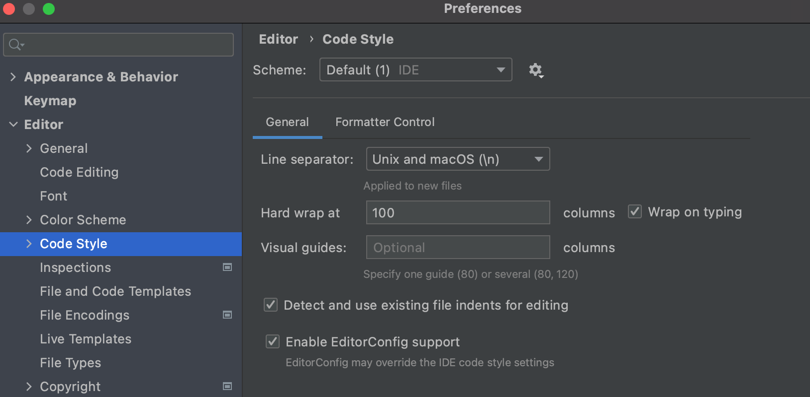

# Code Style Standards

Each language and project has contributed packages that provide conventions for code styling, 
and those packages should be used as part of a pre-commit hook and/or CI runs on PRs.

However, there are some universal coding standards that span projects. Cross project code 
styling guidelines will be placed here as they are defined.

## Line Wraps and Breaks

To keep line breaks and wraps standardized, wrap them at 100 columns. The screenshot below shows 
how to enable the Unix/macOS line separator and wrap lines to 100 columns as you type.

@todo Need to add `.editorconfig` notes since this will do it automatically and can be included 
as a template in repos.

