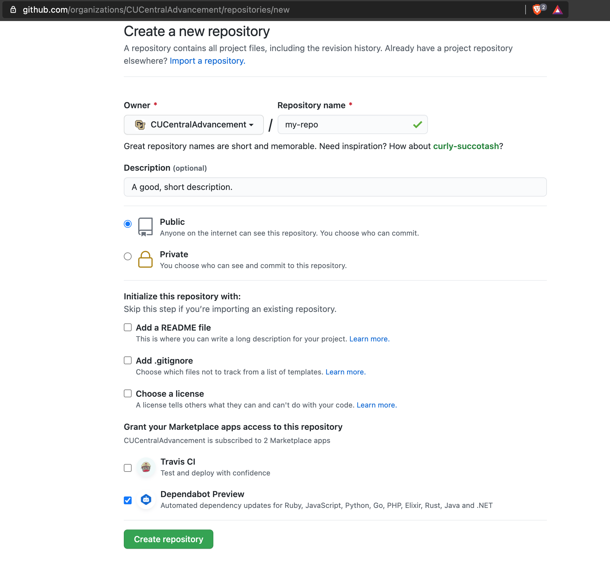

[<-- Home](/readme.md)
# Project Creation

Follow these steps to create a new project in GitHub.

## Repository Creation

It is best to create the repository on GitHub first. Initialize it as a completely blank 
repository as you'll copy template files into your repo at a later step. You should 
default the repository to public unless there is a reason to make it private.



Then, you will need to run a few terminal commands. You should have Git installed to 
complete the steps.

```bash
# Go where you put code.
cd ~/Sites

# Find the remote URL in GitHub.
git clone git@github.com:CUCentralAdvancement/my-repo.git my-repo
cd my-repo
```

## GitHub Template Files

GitHub allows you to create template repositories that generate actual project repositories,
but for now we are copying files from the `/.github` and `/templates` directories. We'll go
through each of the available template files first and then describe how they relate to the
available tech stacks.

GitHub `/.gituhb`:
- `dependabot.yml` - This bot will make a PR (pull request) for every detected dependency
  update. Need to add a stub for this file but current docs are:
  https://docs.github.com/en/code-security/supply-chain-security/configuration-options-for-dependency-updates
  . Not every repository will be able to use Dependabot.
- `stale.yml` - Every repo should add Stalebot. You can keep the defaults or apply them as you
  see fit in your project. Please use the same labels, though, across projects.
- `CODE_OF_CONDUCT.md` - Every project should have a code of conduct and we provide this default.
- `ISSUE_TEMPLATE/bug_report.md` - 
- `ISSUE_TEMPLATE/development-task.md` - 
- `ISSUE_TEMPLATE/feature-story.md` -
- `LICENSE` - The MIT license is the default.
  
General Templates `/templates`:
- `README.md` - Please copy over this generic template and replace the stubs with actual 
project documentation.

## Available Stacks

When beginning a project, you should first know what tech stack the project will use. If you 
can't find the stack you will use, please open an issue in this repository to add a new section
of documentation in the list of tech stacks.

**Stacks:**
- [Next.js (TypeScript, React)](../frontend/nextjs.md) - Used for creating 
  frontends and user interfaces that need medium to advanced interactions, animations, and 
  server-side code.
- [Fiber (Go)](../backend/go.md) - Used for creating small applications without many
  dependencies, ex. a form that takes user input and schedules a task in the backend.
- [Ruby on Rails (Ruby)](../backend/rails.md) - Used for RAD (rapid application development)
  on generic applications, ex. a general CMS backend and admin UI.
- [Phoenix (Elixir)](../backend/rails.md) - Used for similar things as mentioned in the Rails
  and Fiber sections.
- [Salesforce](#need-stub) - Don't know what this is used for so follow the instructions in 
  the Salesforce docs: 
  https://developer.salesforce.com/docs/atlas.en-us.sfdx_dev.meta/sfdx_dev/sfdx_dev_ws_create_new.htm

Please follow instructions in those stubs as far as copying additional template files.
