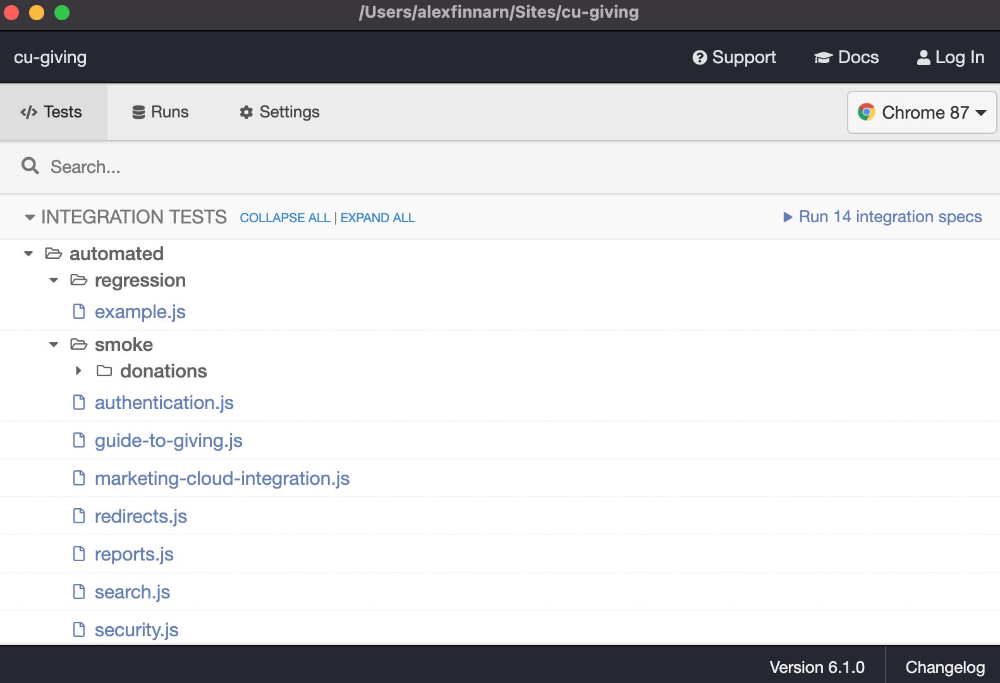

# Cypress

Cypress is a test runner, library, and hosted dashboard all in one package: https://docs.cypress.io/

## Installation

You can add Cypress to any repository via `yarn`.

```bash
yarn add -D cypress
```

Then, you'll want to add a set of testing commands to `package.json`. 

```json
  "scripts": {
    "test": "CYPRESS_baseUrl=https://giving-test.cu.edu cypress run --spec \"cypress/integration/automated/**/*\"",
    "cy:open": "CYPRESS_baseUrl=https://giving-test.cu.edu cypress open"
  },
```

- `CYPRESS_baseUrl=` can be replaced with an environmental variable, but placing it before the command 
works when testing an external system whose base URL doesn't change.
- The `--spec` option narrows down tests to the ones in that directoy.

## First Test Run And IDE Intro

Before you make any test runs, Cypress won't have installed needed files to make the test runner work. You will need to
kick off that process by running one of the commands listed about. Let's go with `yarn cy:open` since that will land us
in the Cypress IDE after initialization.

```bash
# Start Cypress for the first time.
yarn cy:open

# You should see logs about installing Cypress in your terminal...
```

Then, your computer should pull you over to the desktop area to show the Cypress IDE with a list of tests you can run as 
well as change some settings. I won't go into those settings or cross-browser testing. We will use the default settings and
Chromium browser to run our tests.

## Test Structure



The IDE overview screen lists all the tests you have in your codebase under the `/cypress` root directory.


